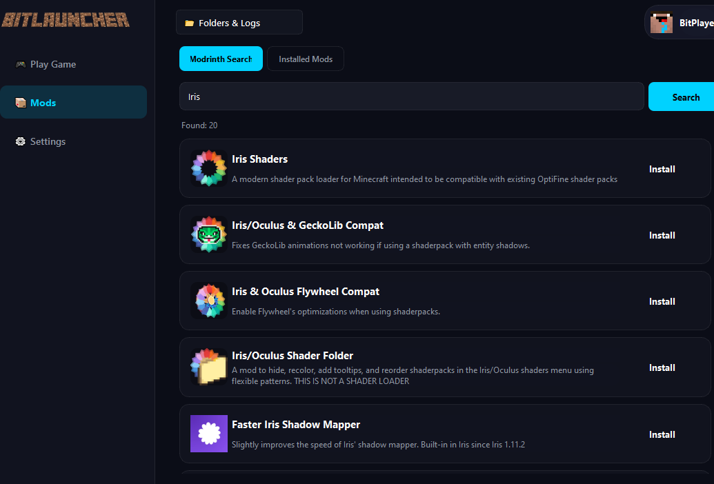
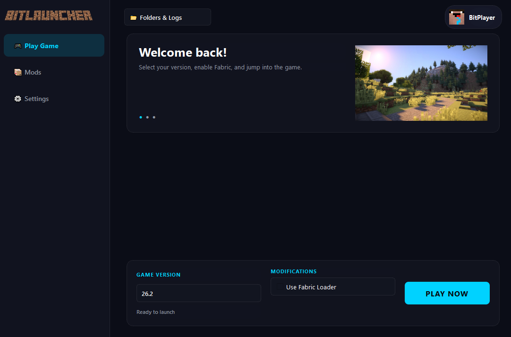

  

 

Minecraft Fabric Python Open-Source Launcher

Minecraft Fabric Python Open-Source Launcher is a lightweight, modern, and fully open-source launcher for Minecraft Java Edition, built with Python and designed with Fabric in mind.

The project focuses on simplicity, performance, customization, and giving users full control over their Minecraft installations.

<table>
  <tr>
    <td width="120" align="center" valign="middle">
      
    </td>
    <td align="center" valign="middle">
      <h2>BitLauncher</h2>
      
Simple Minecraft Fabric Launcher

    </td>
    <td width="180" align="center" valign="middle">
      
    </td>
  </tr>
</table>

✨ Features

 Launch Minecraft Java Edition,
 Full Fabric support,
 Mod installation and management,
 Multiple Minecraft instances,
 Java version selection and management,
 RAM and JVM argument configuration,
 Clean and modern user interface,
 Minecraft directory and configuration management,
 Minecraft version management,
 Fabric Loader management,
 Built-in game log viewer,
 Fast and lightweight startup,
 Fully open-source codebase.

🛠️Built With
Python
Fabric
Minecraft Java Edition
Java / JVM
Git & GitHub

🎯 Project Goals

The goal of this project is to create a simple, reliable, and customizable Minecraft launcher that anyone can use, inspect, modify, and improve.

Instead of overwhelming users with unnecessary features, the launcher focuses on providing the essential tools needed to manage and launch Minecraft with Fabric.

🔓 Open Source

The entire project is open source. Everyone is welcome to:

Explore the source code
Create new features
Fix bugs
Improve performance
Create forks
Submit pull requests
Suggest new ideas

  
  

🚧 Development Status

Currently in development.

The project is actively being developed, and some features may be experimental or unfinished.

📄 License

This project is released under the MIT License.

⭐ If you like the project, consider giving the repository a star!
